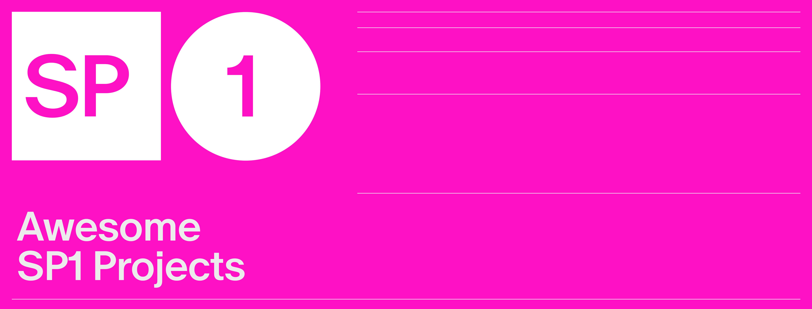

# Awesome SP1

[![Telegram Chat][tg-badge]][tg-url]

[tg-badge]: https://img.shields.io/endpoint?color=neon&logo=telegram&label=chat&url=https://tg.sumanjay.workers.dev/succinct_sp1
[tg-url]: https://t.me/succinct_sp1

A curated list of awesome SP1 resources, tutorials, tools and libraries. Inspired by [awesome-go](https://github.com/avelino/awesome-go).

SP1 is a performant, 100% open-source, contributor-friendly zero-knowledge virtual machine (zkVM) that can prove the execution of arbitrary Rust (or any LLVM-compiled language) programs.

If you want to add a new project or see a project which is no longer a good fit, please submit a pull request to improve this file. Thank you!

## Content

- [Official Resources](#official-resources)
- [Projects](#projects)
  - [Rollups](#rollups)
  - [Light Clients](#light-clients)
  - [Oracles](#oracles)
  - [Web2](#governance)
  - [Miscellaneous](#miscellaneous)
- [Contribute](#contribute)

## Official Resources

- [Docs](https://succinctlabs.github.io/sp1/)
- [GitHub](https://github.com/succinctlabs/sp1)
- [Blog](https://blog.succinct.xyz/introducing-sp1/)

## Projects

### Rollups

- [Reth](https://github.com/succinctlabs/sp1-reth)

### Light Clients

- [Tendermint](https://github.com/succinctlabs/sp1/tree/main/examples/tendermint)

### Oracles

- [Storage Proofs 1](https://github.com/rkdud007/sp1-storage-proof)
- [Storage Proofs 2](https://github.com/aerius-labs/sp1-ethereum-storage-proofs)
- [SSZ Proofs](https://github.com/succinctlabs/sp1/tree/main/examples/ssz-withdrawals)

### Web2

- [ZK Image Editor](https://github.com/Sofianel5/zk-img-editor)
- [Aros](https://github.com/siddhantsharma301/aros)

### Miscellaneous

- [Kinode](https://twitter.com/KinodeOS/status/1760404588056674484)
- [Black Scholes Premium Proof](https://github.com/jpick713/black-scholes-prover)
- [Merkle Tree](https://github.com/rkdud007/sp1-merkle-tree)
